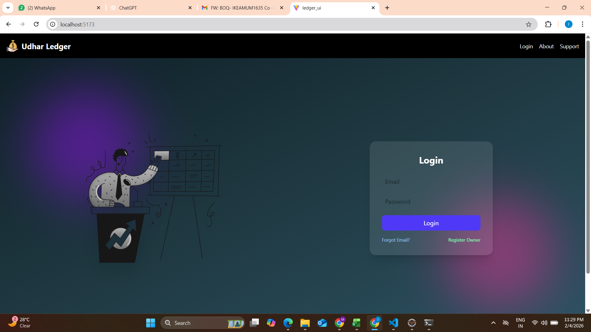
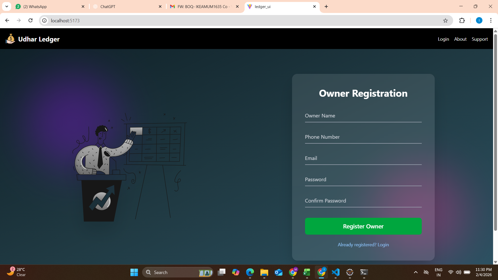
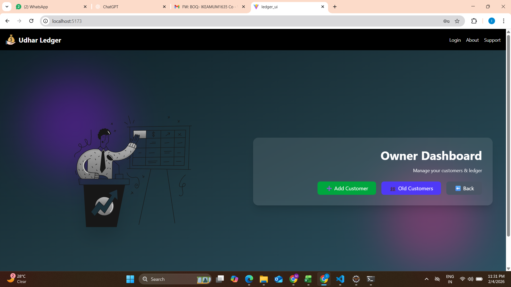
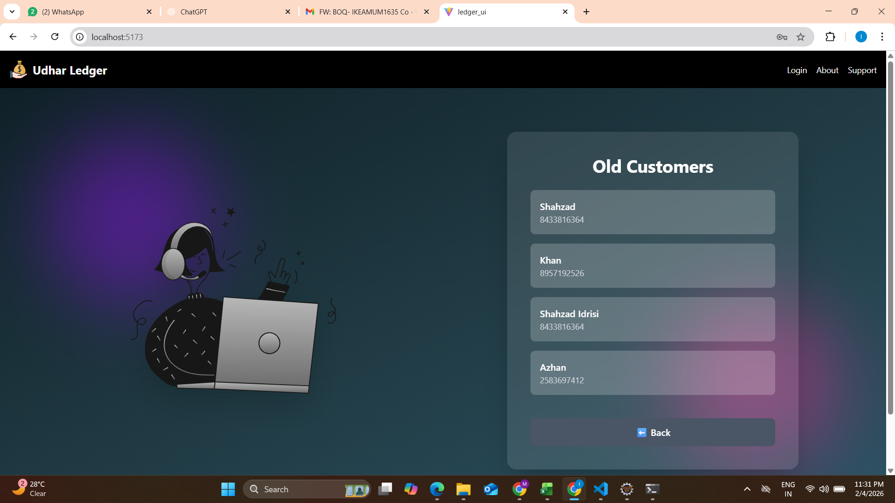
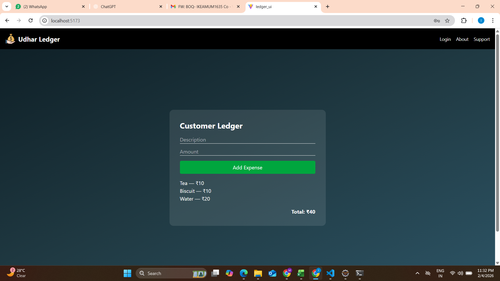
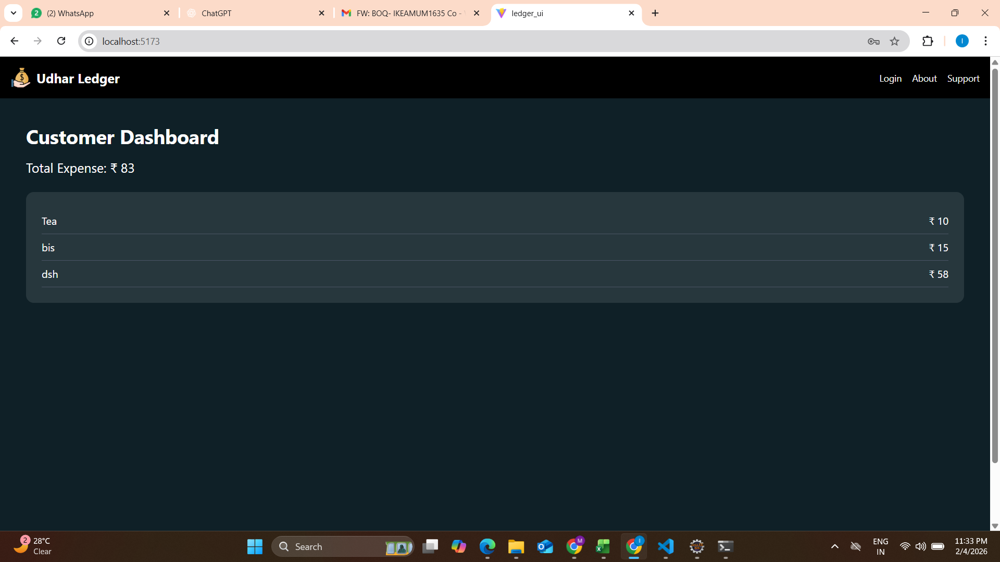

# Credit Ledger System

A modern React UI for a Credit Ledger System (Udhar Ledger) that allows customers to login using OTP verification via email, and view their expense history. Owners can manage customers, add expenses, and track totals.

---

## 🚀 Features

- Customer login with OTP verification
- Owner dashboard for managing customers
- Add and track expenses
- Responsive UI with Tailwind CSS
- Clean and professional design

---

## 🧩 Technologies Used

- React (Vite)
- Tailwind CSS
- Axios / Fetch
- REST API backend (Java + Servlet + MySQL)

---

## 📌 Screenshots

### Home Page

## 📌 Screenshots

### Home Page


### Customer Login


### Owner Registration


### Owner Dashboard


### Old customers


### Owner customer ledger


### Customer Dashboard



---

## 🛠️ Setup & Run (Local)

### 1. Install dependencies
```bash
npm install
